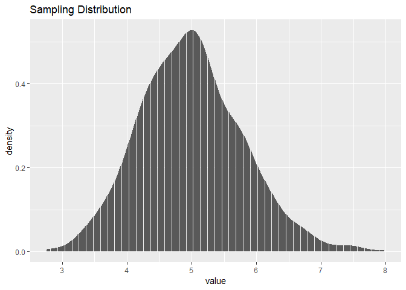
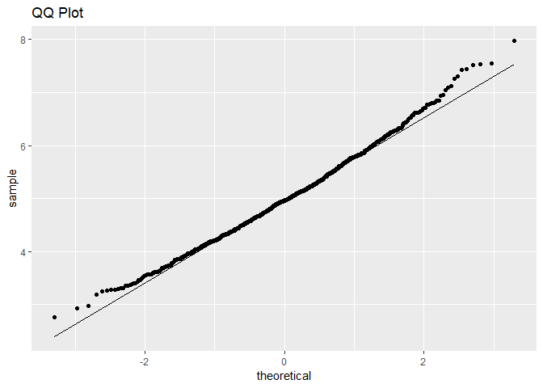
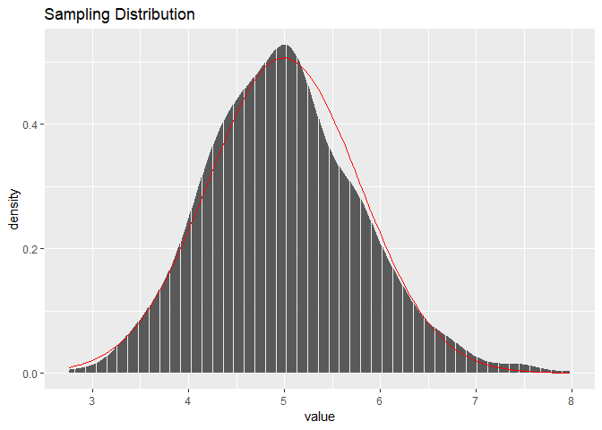

Title: Project to complete the requirements of the Statistical Inference Course.
================================================================================

Author: Muhammad Shahzaib Siddiqui
==================================

Overview:
---------

In this project, we are going to demonstrate our level of understanding
in Statistical Inference Course. There are two parts of the project. In
this part, we generate a sampling distrbution from exponential
distribution and do some statistical process on it.

Part1
-----

    library(ggplot2)
    library(dplyr)
    library(gridExtra)
    set.seed(29)

Plotting the means of samples taken from distributions We are now
calculating the sampling distribution by taking samples of 40 values
from original distribution, calculating their mean and storing them in
mns. We have done this step 1000 times. We then plot the distribution so
it can be visualized. We then calculate the mean and variance of the
sampling distribution.

    mns = NULL
    for (i in 1 : 1000) mns = c(mns, mean(sample(rexp(1000,0.2),40,replace=TRUE)))
    mns<-tbl_df(mns)
    g<-ggplot(mns,aes(value))
    g+geom_histogram(stat="density")+ggtitle("Sampling Distribution")

    ## Warning: Ignoring unknown parameters: binwidth, bins, pad

    sampling_mean<-mean(mns$value)
    sampling_var<-var(mns$value)
    sampling_sd<-sd(mns$value)

QUESTION\#1:
------------

### Show the sample mean and compare it to the theoretical mean of the distribution.

Since the value of lambda we are using is 0.2. According to theory, the
mean and standard deviation of exponential distrbution should be
1/lambda. The mean of the sampling distribution generated by the program
is stored in sampling mean. Let’s display it:

    sampling_mean

    ## [1] 4.992526

The theoretical mean of the distribution should be 1/lambda. Since
lambda=0.2, it is following:

    1/0.2

    ## [1] 5

According to CLT, the mean of the sampling distribution converges to the
mean of original distribution. We can observe that the mean of the
distrbution is approximately equal to the theoretical mean.

QUESTION\#2:
------------

### Show how variable the sample is (via variance) and compare it to the theoretical variance of the distribution.

The variance of the sampling distribution is stored in sampling\_var. It
is following:

    sampling_var

    ## [1] 0.6204817

The theoretical standard deviation of the exponential distribution is
1/lambda. The variance of the sampled distribution is always equal to
variance\_of\_original\_distribution/sample\_size. Let’s display the
theoretical distribution:

    (1/0.2)^2/40

    ## [1] 0.625

We can observe that variance of sampled distribution is approximately
equal to the variance of population divided by sample size.

QUESTION\#3:
------------

### Show that the distribution is approximately normal.

Let’s check the normality of the sampled distribution. We are using
QQplot to check the normality of the data.

    p<-ggplot(mns,aes(sample=value))
    p+stat_qq()+stat_qq_line()+ggtitle("QQ Plot")

As we can observe that majority of the dots are on straight line which
shows that the sampled distribution is approximately normal
distribution.

The visual shape of the distribution has a bell curve and is almost
covered under the normal distribution density function which is another
evidence of normal distribution.

    g<-ggplot(mns,aes(value))
    g+geom_histogram(stat="density")+ggtitle("Sampling Distribution")+stat_function(fun=function(x) {dnorm(x,mean(mns$value),sd(mns$value))},color="red")

    ## Warning: Ignoring unknown parameters: binwidth, bins, pad

