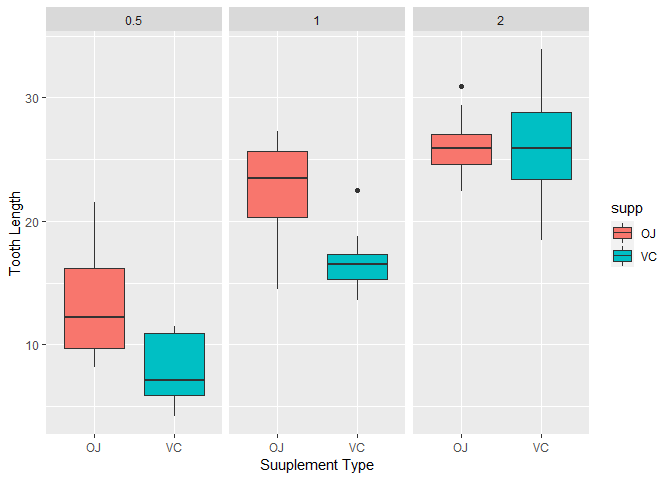

Title: Project to complete the requirements of the Statistical Inference Course.
================================================================================

Author: Muhammad Shahzaib Siddiqui
==================================

Overview:
---------

In this project, we are going to demonstrate our level of understanding
in Statistical Inference Course. We take a dataset from the R dataset
packages and do statistical inference tests on it. We make certain
assumptions about the data after visualizing it then test our
assumptions through t-test.

Assumptions:
------------

We are working on following assumptions:

1.  The data is normally distributed.
2.  The data is randomly taken.
3.  The samples are independent from each other and have unequal
    variances.

Part2
-----

    data(ToothGrowth)
    dim(ToothGrowth)

    ## [1] 60  3

    summary(ToothGrowth)

    ##       len        supp         dose      
    ##  Min.   : 4.20   OJ:30   Min.   :0.500  
    ##  1st Qu.:13.07   VC:30   1st Qu.:0.500  
    ##  Median :19.25           Median :1.000  
    ##  Mean   :18.81           Mean   :1.167  
    ##  3rd Qu.:25.27           3rd Qu.:2.000  
    ##  Max.   :33.90           Max.   :2.000

    a<-ToothGrowth

Let’s visualize the data:

    g<-ggplot(a,aes(a$supp,a$len))
    g+geom_boxplot(aes(fill=supp))+facet_grid(.~dose)+xlab("Suuplement Type")+ylab("Tooth Length")

    ## Warning: Use of `a$supp` is discouraged. Use `supp` instead.

    ## Warning: Use of `a$len` is discouraged. Use `len` instead.

In the plots, we can visualize that length increases as the dosage is
increased. And in the two diagrams, we can observe that tooth lengths of
OJ is greater than VC. Let’s verify these hypothesis with t tests.

There are basically two types of supplement. We can observe it:

    table(ToothGrowth$supp)

    ## 
    ## OJ VC 
    ## 30 30

There are three types of dosage. We can observe it:

    table(ToothGrowth$dose)

    ## 
    ## 0.5   1   2 
    ##  20  20  20

Let’s check the tooth length based on the supplement type. Our null
hypothesis is OJ\_Length=VC\_Length. So our alternative hypothesis is
OJ\_Length&gt;VC\_Length Our alpha value is 0.05.

    OJ<-ToothGrowth$len[ToothGrowth$supp=="OJ"]
    VC<-ToothGrowth$len[ToothGrowth$supp=="VC"]
    t.test(OJ,VC,alternative="greater",paired=FALSE,var.equal=FALSE,conf.level=0.95)

    ## 
    ##  Welch Two Sample t-test
    ## 
    ## data:  OJ and VC
    ## t = 1.9153, df = 55.309, p-value = 0.03032
    ## alternative hypothesis: true difference in means is greater than 0
    ## 95 percent confidence interval:
    ##  0.4682687       Inf
    ## sample estimates:
    ## mean of x mean of y 
    ##  20.66333  16.96333

As we can observe that p value is lower than alpha so we reject the null
hypothesis.

Let’s do t test for dosage levels. There are three dosage levels.

    table(ToothGrowth$dose)

    ## 
    ## 0.5   1   2 
    ##  20  20  20

    val_1<-ToothGrowth$len[ToothGrowth$dose==0.5]
    val_2<-ToothGrowth$len[ToothGrowth$dose==1]
    val_3<-ToothGrowth$len[ToothGrowth$dose==2]

Let’s check the tooth length based on the dosage of the supplement type.
Our null hypothesis is 0.5\_Length=1\_Length. So our alternative
hypothesis is 0.5\_Length&lt;1\_Length Our alpha value is 0.05.

    t.test(val_2,val_1,alternative="greater",paired=FALSE,var.equal=FALSE,conf.level=0.95)

    ## 
    ##  Welch Two Sample t-test
    ## 
    ## data:  val_2 and val_1
    ## t = 6.4766, df = 37.986, p-value = 6.342e-08
    ## alternative hypothesis: true difference in means is greater than 0
    ## 95 percent confidence interval:
    ##  6.753323      Inf
    ## sample estimates:
    ## mean of x mean of y 
    ##    19.735    10.605

As we can observe that p value is significantly lower than the alpha
value hence we can conclude the alternative hypothesis.

Let’s repeat the same testing process on dosage 2 and 1 with same alpha
level.

    t.test(val_3,val_2,alternative="greater",paired=FALSE,var.equal=FALSE,conf.level=0.95)

    ## 
    ##  Welch Two Sample t-test
    ## 
    ## data:  val_3 and val_2
    ## t = 4.9005, df = 37.101, p-value = 9.532e-06
    ## alternative hypothesis: true difference in means is greater than 0
    ## 95 percent confidence interval:
    ##  4.17387     Inf
    ## sample estimates:
    ## mean of x mean of y 
    ##    26.100    19.735

As we can observe that p value is significantly lower than the alpha
value hence we can conclude the alternative hypothesis.

Let’s conduct the dosage test based on the supplement type.

    val_1OJ<-ToothGrowth$len[ToothGrowth$dose==0.5 & ToothGrowth$supp=="OJ"]
    val_2OJ<-ToothGrowth$len[ToothGrowth$dose==1 & ToothGrowth$supp=="OJ"]
    val_3OJ<-ToothGrowth$len[ToothGrowth$dose==2 & ToothGrowth$supp=="OJ"]

Our null hypothesis is 0.5dose\_Length=1dose\_Length. So our alternative
hypothesis is 0.5dose\_Length&lt;1dose\_Length Our alpha value is 0.05.

    t.test(val_2OJ,val_1OJ,alternative="greater",paired=FALSE,var.equal=FALSE,conf.level=0.95)

    ## 
    ##  Welch Two Sample t-test
    ## 
    ## data:  val_2OJ and val_1OJ
    ## t = 5.0486, df = 17.698, p-value = 4.392e-05
    ## alternative hypothesis: true difference in means is greater than 0
    ## 95 percent confidence interval:
    ##  6.214316      Inf
    ## sample estimates:
    ## mean of x mean of y 
    ##     22.70     13.23

As we can observe that p value is significantly lower than the alpha
value hence we can conclude the alternative hypothesis.

    t.test(val_3OJ,val_2OJ,alternative="greater",paired=FALSE,var.equal=FALSE,conf.level=0.95)

    ## 
    ##  Welch Two Sample t-test
    ## 
    ## data:  val_3OJ and val_2OJ
    ## t = 2.2478, df = 15.842, p-value = 0.0196
    ## alternative hypothesis: true difference in means is greater than 0
    ## 95 percent confidence interval:
    ##  0.7486236       Inf
    ## sample estimates:
    ## mean of x mean of y 
    ##     26.06     22.70

As we can observe that p value is significantly lower than the alpha
value hence we can conclude the alternative hypothesis.

    val_1VC<-ToothGrowth$len[ToothGrowth$dose==0.5 & ToothGrowth$supp=="VC"]
    val_2VC<-ToothGrowth$len[ToothGrowth$dose==1 & ToothGrowth$supp=="VC"]
    val_3VC<-ToothGrowth$len[ToothGrowth$dose==2 & ToothGrowth$supp=="VC"]
    t.test(val_2VC,val_1VC,alternative="greater",paired=FALSE,var.equal=FALSE,conf.level=0.95)

    ## 
    ##  Welch Two Sample t-test
    ## 
    ## data:  val_2VC and val_1VC
    ## t = 7.4634, df = 17.862, p-value = 3.406e-07
    ## alternative hypothesis: true difference in means is greater than 0
    ## 95 percent confidence interval:
    ##  6.746867      Inf
    ## sample estimates:
    ## mean of x mean of y 
    ##     16.77      7.98

As we can observe that p value is significantly lower than the alpha
value hence we can conclude the alternative hypothesis.

    t.test(val_3VC,val_2VC,alternative="greater",paired=FALSE,var.equal=FALSE,conf.level=0.95)

    ## 
    ##  Welch Two Sample t-test
    ## 
    ## data:  val_3VC and val_2VC
    ## t = 5.4698, df = 13.6, p-value = 4.578e-05
    ## alternative hypothesis: true difference in means is greater than 0
    ## 95 percent confidence interval:
    ##  6.346525      Inf
    ## sample estimates:
    ## mean of x mean of y 
    ##     26.14     16.77

As we can observe that p value is significantly lower than the alpha
value hence we can conclude the alternative hypothesis.

Hence in all cases, we can conclude that length is positively affected
by dosage. Indeed this was our assumption that length is proportional to
the dosage.
